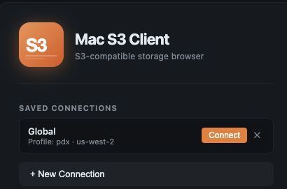

# Mac S3 Client

A native macOS desktop client for Amazon S3, built with Electron + React. Provides a dual-pane interface (local filesystem ↔ S3) with a dark AWS-themed UI.



---

## Features

### Connection Management
- **AWS Profile** — reads credentials from `~/.aws/credentials` / `~/.aws/config`
- **Access Keys** — enter Access Key ID + Secret Access Key directly
- **Saved Connections** — connections are persisted locally; secrets are encrypted with macOS Keychain via Electron `safeStorage` (never stored in plaintext)

### File Browser
- **Dual-pane layout** — local filesystem on the left, S3 on the right; draggable divider to resize
- **Sortable file table** — sort by name, size, type, or last modified
- **Storage class column** — STANDARD / IA / GLACIER / etc.
- **Search / filter** — instant client-side filtering
- **Breadcrumb navigation** — click any segment to jump back

### S3 Operations
- Upload files (dialog picker or drag from local pane)
- Download single file or batch download with progress bar
- Delete single file or batch delete (inline confirmation, no browser dialogs)
- Create folder
- Rename file (inline editing, Enter to confirm / Escape to cancel)
- Right-click context menu on every file row

### Advanced Features
| Feature | Description |
|---|---|
| **Presigned URL** | Right-click → Copy Presigned URL → choose expiry (15 min / 1 h / 24 h / 7 days) → URL copied to clipboard |
| **Image / Video Preview** | Click any image or video file to preview in-app (no download required for images) |
| **Version History** | View all object versions, restore an old version, or delete a specific version |
| **Folder Sync** | One-way sync from a local directory to an S3 prefix — MD5 comparison for files < 64 MB |
| **Bucket Policy Viewer** | Right-click a bucket → View Policy (read-only formatted JSON) |
| **Multipart Upload** | Files above the configurable threshold (default 64 MB) are automatically uploaded in parallel parts |
| **Transfer History** | Collapsible panel at the bottom shows all upload/download activity with progress |

### Bucket Management
- Empty bucket (with live deletion counter)
- Delete bucket (empties first, then deletes)
- Right-click bucket for context menu

---

## Requirements

- macOS 12 or later (Apple Silicon and Intel both supported)
- Node.js 18+
- An AWS account with S3 access, or compatible credentials

---

## Development

```bash
# Clone the repo
git clone https://github.com/your-username/S3-MacClient.git
cd S3-MacClient/s3-client

# Install dependencies
npm install

# Build and launch
npm start
```

### Build commands

| Command | Description |
|---|---|
| `npm start` | Build everything and launch Electron |
| `npm run build` | Build main process (tsc) + renderer (esbuild) |
| `npm run build:main` | Compile `src/main/**` with TypeScript |
| `npm run build:renderer` | Bundle `src/renderer/**` with esbuild + copy `index.html` |
| `npm run dist` | Build a distributable `.dmg` (universal binary) |

### Project structure

```
s3-client/
├── src/
│   ├── main/
│   │   ├── main.ts          # Electron main process, IPC handlers
│   │   ├── s3service.ts     # AWS SDK wrapper (S3 operations)
│   │   └── preload.ts       # contextBridge — exposes window.s3api
│   └── renderer/
│       ├── App.tsx           # Root component, dual-pane layout
│       ├── theme.css         # CSS variables (AWS dark theme)
│       ├── components/
│       │   ├── ConnectionPanel.tsx
│       │   ├── S3Pane.tsx
│       │   ├── LocalPane.tsx
│       │   ├── FileTable.tsx
│       │   ├── ContextMenu.tsx
│       │   ├── TransferBar.tsx
│       │   ├── PreviewModal.tsx
│       │   ├── VersionsModal.tsx
│       │   └── SyncModal.tsx
│       └── hooks/
│           ├── useS3.ts
│           ├── useLocalFS.ts
│           └── useTransfers.ts
├── build-renderer.mjs        # esbuild script
├── tsconfig.main.json
├── tsconfig.renderer.json
└── package.json
```

---

## Security & Privacy

### Credential storage
- **AWS Profile mode**: no credentials are stored by this app — the AWS SDK reads `~/.aws/credentials` directly.
- **Access Keys mode**: the `secretAccessKey` is **never stored in plaintext**. It is encrypted with `safeStorage.encryptString()` (Electron's built-in API, backed by macOS Keychain) and stored as a base64-encoded ciphertext in `connections.json`.
- `connections.json` is stored in the Electron `userData` directory (`~/Library/Application Support/mac-s3-client/`) and is **not part of the repository**.

### Network
- All S3 API calls go directly from your machine to AWS endpoints over HTTPS.
- No telemetry, analytics, or third-party services.
- No proxy or relay — your credentials and data never touch any server other than AWS.

### Electron security settings
- `contextIsolation: true` — renderer process is fully sandboxed from Node.js.
- `nodeIntegration: false` — renderer cannot access Node.js APIs directly.
- All Node.js access goes through the typed `window.s3api` bridge defined in `preload.ts`.

### What this app does NOT do
- No auto-update that fetches remote code
- No crash reporting
- No usage analytics
- Does not read any files outside of paths you explicitly navigate to or select

---

## Tech Stack

| Layer | Technology |
|---|---|
| Shell | Electron 33 |
| Frontend | React 18 + TypeScript |
| Bundler | esbuild |
| AWS SDK | `@aws-sdk/client-s3` v3, `@aws-sdk/s3-request-presigner` |
| Packaging | electron-builder (DMG, universal binary) |

---

## License

MIT
